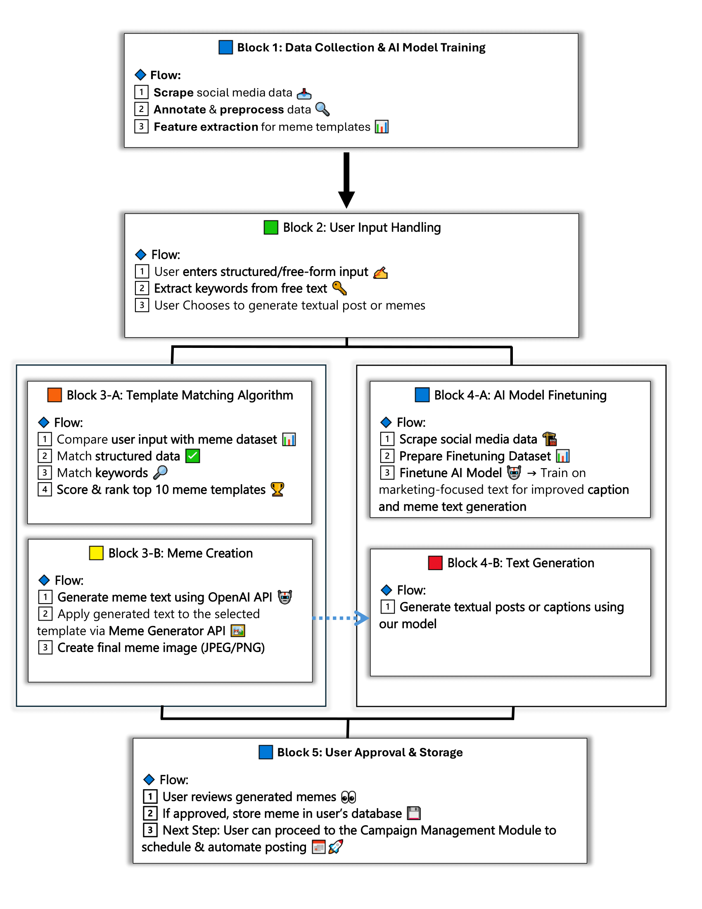

# Hype Radar

## Introduction

Hype Radar is a powerful social media analytics tool designed to help small businesses and influencers optimize their online presence. By leveraging AI-driven insights, Hype Radar identifies trends, analyzes sentiments, and predicts content performance across multiple social media platforms, including Facebook, Instagram, and Twitter.

## Modules & Features

Hype Radar consists of 3 key modules designed to streamline social media marketing and analytics:

- **1: Generation Module**: Empowers users to generate engaging social media content, including textual posts and memes. Using AI-driven models, it creates high-quality content that aligns with current trends and audience preferences.

- **2: Campaign Management**: Facilitates automated social media posting and scheduling. Users can schedule posts at specific intervals, ensuring optimal engagement. Additionally, this module leverages audience analytics to determine the best times for posting and can automate content publication based on audience activity trends.

- **3: Trend Analytics**: Provides deep insights into user accounts and page performance. Through interactive and dynamic charts, users can track engagement, audience growth, and post effectiveness, helping them refine their social media strategies.

## Architecture Diagram

Here’s an overview of how the **Generation Module** works:



## Roadmap

Upcoming features will expand functionality using Modules 2 and 3.

## Getting Started

1. Clone this repository:
   ```sh
   git clone https://github.com/your-repo/hype-radar.git
   ```
2. Install dependencies:
   ```sh
   cd hype-radar
   npm install  # or pip install -r requirements.txt
   ```
3. Run the project:
   ```sh
   npm start  # or python app.py
   ```

Stay tuned for updates and new features in future releases! 🚀
